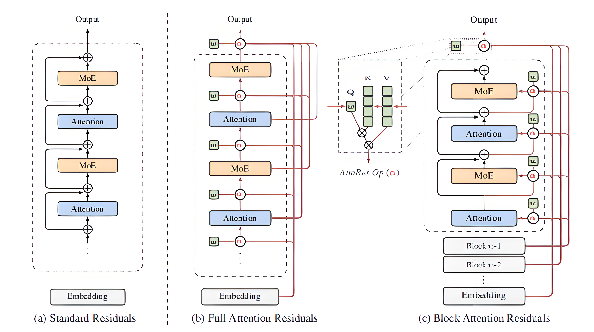
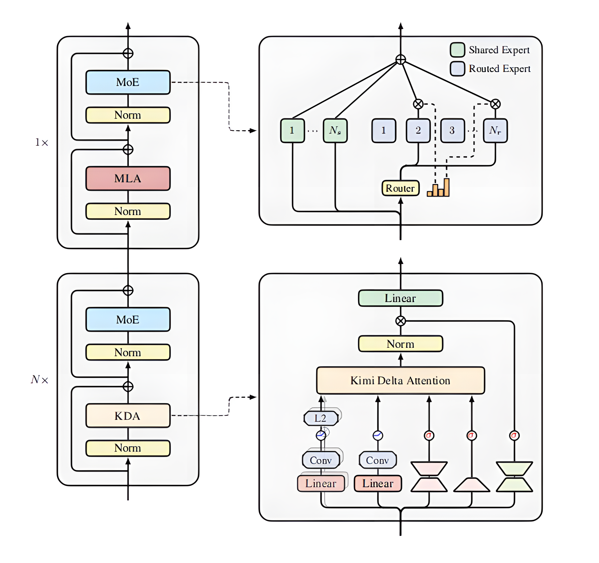
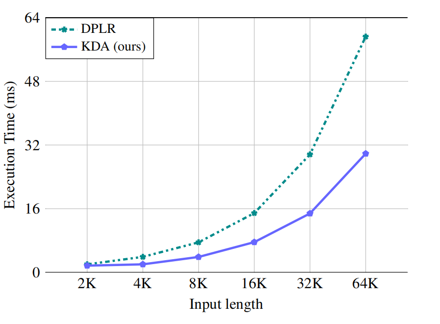

# kimi-attention

A PyTorch implementation of Kimi's attention mechanisms — **Attention Residuals (AttnRes)** and **Kimi Delta Attention (KDA)**.

> **Paper**: [Attention Residuals](https://arxiv.org/abs/2603.15031) · [Kimi Linear](https://arxiv.org/abs/2510.26692)

---

## Abstract

This repository implements two mechanisms from Moonshot AI's Kimi model series:

| Mechanism | Core Idea | Reported Gains |
|-----------|-----------|----------------|
| **Attention Residuals** | Replaces fixed residual summation with depth-wise attention | +25% training efficiency, +7.5 GPQA-Diamond, +3.1 HumanEval |
| **Kimi Delta Attention** | Linear attention with per-dimension independent forget gates | 6x decode speed, -75% KV cache, 3.98x throughput |

Both are drop-in replacements for standard Transformer layers.

---

## Development Status

- **Version**: 1.0.0
- **Python**: 3.9 – 3.12
- **PyTorch**: 2.0+

---

## Quick Start

### Installation

```bash
git clone https://github.com/Fengrru/kimi-attention.git
cd kimi-attention

# Basic (CPU & GPU)
pip install -e .

# With CUDA-optimized KDA kernels
pip install -e ".[flash]"

# Development
pip install -e ".[dev,flash,train]"
```

---

## Architecture

<p align="center">
  
</p>
<p align="center"><em>Hybrid KDA-MHA Transformer with Attention Residuals across layers</em></p>

### Attention Residuals

<p align="center">
  
</p>
<p align="center"><em>Attention Residuals — depth-wise dynamic weighting across previous layers</em></p>

---

## Requirements

- **Python**: 3.9 – 3.12
- **PyTorch**: 2.0+
- **CUDA**: 11.8+ (optional, for FLA kernel acceleration)
- **GPU Memory (1B model, params only)**: ~4 GB (FP32), ~2 GB (FP16); ~8 GB (FP16 with KV cache @ 32K context)
- **GPU Memory (7B model, params only)**: ~28 GB (FP32), ~14 GB (FP16); ~40 GB (FP16 with KV cache @ 128K context)

> ⚠️ Values are **parameter-only estimates**. Real-world usage adds KV cache (significant at long context), activations, and optimizer states (+2× params for Adam). For 7B @ 128K with standard MHA, KV cache alone can exceed 30 GB in FP16.

---

## Usage

```python
from kimi_attention import KimiTransformer, KimiConfig

# Load preset (1B, 7B, 48B — see Presets section for details)
config = KimiConfig.from_size("7B")

# Or define custom
config = KimiConfig(dim=512, num_layers=8, num_heads=8, vocab_size=32000)

model = KimiTransformer(config)

# Forward
import torch
input_ids = torch.randint(0, config.vocab_size, (2, 128))
logits = model(input_ids)  # [2, 128, vocab_size]

# Generate
output = model.generate(input_ids, max_new_tokens=100, temperature=0.8, top_k=50)
```

### Standalone KDA Layer

```python
from kimi_attention import KimiDeltaAttentionLayer

kda = KimiDeltaAttentionLayer(dim=512, num_heads=8)
output = kda(input)  # [B, T, D]
```

### AttnRes Integration

```python
from kimi_attention import BlockAttentionResiduals

attn_res = BlockAttentionResiduals(dim=512, layers_per_block=4)

blocks, hidden = [], embedding_output
for layer_idx in range(num_layers):
    blocks, hidden = attn_res(
        blocks=blocks,
        hidden_states=hidden,
        layer_number=layer_idx,
        attn_fn=your_attention,
        mlp_fn=your_ffn,
        attn_norm=your_attn_norm,
        mlp_norm=your_mlp_norm,
    )
```

### KDA/MHA Ratio

| `kda_every` | Ratio | Use case |
|-------------|-------|----------|
| 4 (default) | 3:1 KDA:MHA | Best speed/accuracy tradeoff |
| `None` | All KDA | Maximum efficiency |
| 1 | All MHA | Standard Transformer |

### More Examples

See [`examples/`](examples/) for complete runnable scripts:

| Script | Shows |
|--------|-------|
| [`example_attnres_only.py`](examples/example_attnres_only.py) | Standalone AttnRes with gradient verification |
| [`example_kda_only.py`](examples/example_kda_only.py) | KDA as drop-in replacement for MHA |
| [`example_train_custom.py`](examples/example_train_custom.py) | End-to-end training + generation |

```python
# AttnRes-only mode: standard MHA + depth aggregation (no KDA)
config = KimiConfig.from_size("1B")
config.kda_every = 1
config.attn_res_only = True
model = KimiTransformer(config)
```

---

## Presets

| Model | Layers | Dim | Heads | Vocab | Max Context | Architecture | Params |
|-------|--------|-----|-------|-------|-------------|-------------|--------|
| **1B**† | 24 | 2048 | 8 | 32K | 32K | Dense | ~1B |
| **7B**† | 32 | 4096 | 32 | 64K | 128K | Dense | ~7B |
| **48B** | 64 | 8192 | 64 | 128K | 1M | **MoE** (256 experts, 8 active + 1 shared) | ~48B total / ~3B active |

> † The 1B and 7B presets are **unofficial configurations** derived by this repository from the paper descriptions. Moonshot AI has only released the [48B MoE model](https://huggingface.co/moonshotai/Kimi-Linear-48B-A3B-Base) officially.

---

## Performance

<p align="center">
  
</p>

Benchmarks measured on NVIDIA A100-80GB with 1M context length, comparing KDA against standard Multi-Head Attention (MHA). KDA achieves **6× decode speedup** and **75% KV cache reduction** at long context, with **3.98× throughput** improvement.

> Numbers from [Kimi Linear paper](https://arxiv.org/abs/2510.26692). Run `python scripts/benchmark.py` to reproduce.

---

## Training

```bash
python scripts/train.py \
    --config 1B \
    --batch_size 32 \
    --max_steps 100000 \
    --learning_rate 3e-4 \
    --warmup_steps 2000 \
    --output_dir ./checkpoints
```

Features: AMP, cosine LR with warmup, gradient clipping, checkpointing, WandB integration.

---

## Project Structure

```
kimi-attention/
├── kimi_attention/
│   ├── models/           # Core modules
│   │   ├── attention_residuals.py
│   │   ├── delta_attention.py
│   │   ├── transformer.py
│   │   ├── rmsnorm.py
│   │   ├── rope.py
│   │   └── moe.py
│   ├── configs/          # Official presets
│   └── utils/            # Logging utilities
├── tests/                # 148 tests
├── scripts/              # Training & inference
└── examples/             # Integration examples
```

---

## Linting

```bash
# Format
black kimi_attention/ tests/ scripts/ examples/
isort kimi_attention/ tests/ scripts/ examples/

# Lint
flake8 kimi_attention/ tests/ scripts/ examples/ --max-line-length=100

# Type check
mypy kimi_attention/ --ignore-missing-imports

# Tests
pytest tests/ -v
```

---

## Citation

```bibtex
@misc{moonshot2026attnres,
  title={Attention Residuals},
  author={Kimi Team},
  year={2026},
  eprint={2603.15031},
  archivePrefix={arXiv},
  primaryClass={cs.CL}
}

@article{moonshot2025kimilinear,
  title={Kimi Linear: An Expressive, Efficient Attention Architecture},
  author={Kimi Team},
  journal={arXiv preprint arXiv:2510.26692},
  year={2025}
}
```

---

## License

[Apache 2.0](LICENSE)

---

## Acknowledgments

- [Moonshot AI](https://github.com/MoonshotAI) for the original research
- [Flash Linear Attention](https://github.com/fla-org/flash-linear-attention) for CUDA kernels
