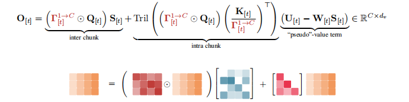

# kimi-attention

[](https://www.python.org/downloads/)
[](https://pytorch.org/)
[](LICENSE)
[](https://github.com/Fengrru/kimi-attention/actions/workflows/test.yml)
[](https://github.com/psf/black)

A PyTorch implementation of [Kimi's attention mechanisms](https://arxiv.org/abs/2603.15031) — Attention Residuals (AttnRes) and Kimi Delta Attention (KDA).

> **Papers**: [Attention Residuals](https://arxiv.org/abs/2603.15031) | [Kimi Linear](https://arxiv.org/abs/2510.26692)
> **Reference**: [Moonshot AI](https://github.com/MoonshotAI) | [FLA Kernels](https://github.com/fla-org/flash-linear-attention)

## Abstract

This repository implements the two core attention innovations from Moonshot AI's Kimi model series:

| Mechanism | Core Idea | Reported Gains |
|-----------|-----------|----------------|
| **Attention Residuals (AttnRes)** | Replaces fixed residual summation with depth-wise attention that dynamically weights previous layers | +25% training efficiency, +7.5 GPQA, +3.1 HumanEval |
| **Kimi Delta Attention (KDA)** | Linear attention with per-dimension independent forget gates | 6x decode speed (1M ctx), -75% KV cache, 3.98x throughput |

Both are designed as drop-in replacements for standard Transformer layers.

## Development Status

- **Version**: 1.0.0
- **Tests**: 148 passing
- **Python**: 3.9 - 3.12
- **PyTorch**: 2.0+

## Quick Start

### Installation

```bash
# Basic (CPU & GPU)
pip install -e .

# With CUDA-optimized KDA kernels
pip install -e ".[flash]"

# Development
pip install -e ".[dev,flash,train]"
```

## Architecture

<p align="center">
  
</p>

<p align="center">
  
</p>

<p align="center">
  
</p>

### Usage

```python
from kimi_attention import KimiTransformer, KimiConfig, KimiDeltaAttentionLayer, BlockAttentionResiduals

# Full model (hybrid 3:1 KDA:MHA)
config = KimiConfig.from_size("7B")  # or "1B", "48B"
model = KimiTransformer(config)

# Forward
import torch
input_ids = torch.randint(0, config.vocab_size, (2, 128))
logits = model(input_ids)  # [2, 128, vocab_size]

# Generate
output = model.generate(input_ids, max_new_tokens=100, temperature=0.8, top_k=50)

# Standalone KDA layer (drop-in for nn.MultiheadAttention)
kda = KimiDeltaAttentionLayer(dim=512, num_heads=8)

# AttnRes wrapper (zero-change integration)
attn_res = BlockAttentionResiduals(dim=512, layers_per_block=4)
```

Configure KDA/MHA ratio via `kda_every`:

| `kda_every` | Ratio | Use case |
|-------------|-------|----------|
| 4 (default) | 3:1 KDA:MHA | Best speed/accuracy tradeoff |
| 0 | all KDA | Maximum efficiency |
| 1 | all MHA | Standard Transformer |

## Presets

| Model | Layers | Dim | Heads | Vocab | Max Context | Params |
|-------|--------|-----|-------|-------|-------------|--------|
| **1B** | 24 | 2048 | 8 | 32K | 32K | ~1B |
| **7B** | 32 | 4096 | 32 | 64K | 128K | ~7B |
| **48B** | 64 | 8192 | 64 | 128K | 1M | ~48B |

## Performance

<p align="center">
  
</p>

## Project Structure

```
kimi-attention/
├── kimi_attention/
│   ├── models/
│   │   ├── attention_residuals.py   # AttnRes
│   │   ├── delta_attention.py       # KDA
│   │   ├── transformer.py           # KimiTransformer, KimiConfig
│   │   ├── rmsnorm.py               # RMSNorm
│   │   ├── rope.py                  # RotaryEmbedding
│   │   └── moe.py                   # MoE FFN
│   └── configs/                     # Official presets (1B/7B/48B)
├── tests/                           # 148 tests
├── scripts/
│   ├── train.py                     # Training with AMP, LR scheduling
│   ├── inference.py                 # Inference script
│   └── benchmark.py                 # Performance benchmarking
└── examples/                        # Integration examples
```

## Training

```bash
python scripts/train.py \
    --config 1B \
    --batch_size 32 \
    --max_steps 100000 \
    --learning_rate 3e-4 \
    --warmup_steps 2000 \
    --output_dir ./checkpoints
```

Features: AMP, cosine LR with warmup, gradient clipping, checkpointing, WandB integration.

## API Reference

| Class | Description |
|-------|-------------|
| `KimiConfig(...)` | Model configuration dataclass |
| `KimiTransformer(config)` | Complete model (AttnRes + hybrid KDA) |
| `KimiDeltaAttentionLayer(dim, num_heads)` | Drop-in KDA layer |
| `BlockAttentionResiduals(dim, layers_per_block)` | AttnRes wrapper |
| `KIMI_LINEAR_{1B,7B,48B}_CONFIG` | Official presets |

See docstrings in each module for full API documentation.

## Testing

```bash
pytest tests/ -v                                          # all tests
pytest tests/ --cov=kimi_attention --cov-report=term-missing  # with coverage
pytest tests/test_delta_attention.py -v                   # single module
```

## Citation

```bibtex
@article{moonshot2025attnres,
  title={Attention Residuals for Deep Transformer Networks},
  author={Moonshot AI},
  journal={arXiv preprint arXiv:2603.15031},
  year={2025}
}

@article{moonshot2025kimilinear,
  title={Kimi Linear: Scaling Linear Attention to 48 Billion Parameters},
  author={Moonshot AI},
  journal={arXiv preprint arXiv:2510.26692},
  year={2025}
}
```

## License

[Apache 2.0](LICENSE)

## Acknowledgments

- [Moonshot AI](https://github.com/MoonshotAI) for the original research
- [Flash Linear Attention](https://github.com/fla-org/flash-linear-attention) for CUDA kernels
